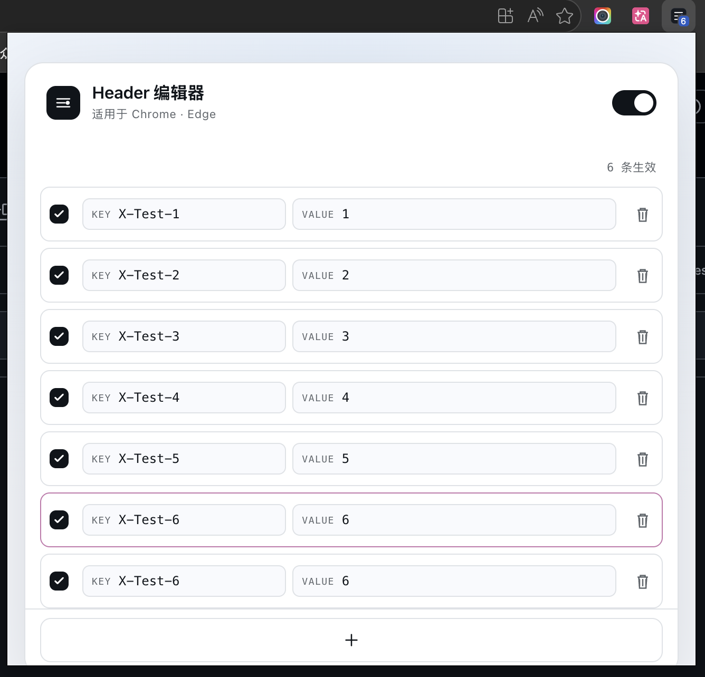

# Header Patch

[English](README.md)

Header Patch 是一个适用于 Chrome 和 Edge 的轻量级 Manifest V3 扩展，用于写入或覆盖浏览器请求 Header。规则保存在浏览器本地，修改后立即生效。

<p align="center">
  
</p>

## 功能

- 为 HTTP 和 HTTPS 资源设置请求 Header。
- 单独启停规则，或通过总开关统一暂停和恢复。
- 校验 Header 名称，并以“后面的同名规则优先”处理重复项。
- 在弹窗和工具栏角标显示实际生效的规则数。
- 根据浏览器语言自动显示英文或简体中文界面。
- 配置仅存储在浏览器本地，不包含统计或远程服务。

## 从源码安装

需要 Node.js 20.19 或更高版本及 npm。

```bash
npm ci
npm run verify
```

打开 `chrome://extensions` 或 `edge://extensions`，启用“开发者模式”，点击“加载已解压的扩展程序”，选择生成的 `dist` 目录。

也可以从项目的 GitHub Releases 页面下载 ZIP，解压后加载对应目录。

## 开发与验证

```bash
npm run dev
```

普通网页预览使用 `localStorage`。只有将项目加载为浏览器扩展后，才会真正修改请求 Header。

执行公开内容检查、单元测试和生产构建：

```bash
npm run verify
```

构建后执行隔离浏览器回归：

```bash
npm run test:e2e
```

浏览器测试会自行启动仅监听 localhost 的服务以及隔离的 Chrome 或 Edge 配置。浏览器不在标准路径时可设置 `BROWSER_PATH`，测试不依赖任何外部站点。

版本标签会生成经过验证的 ZIP 和 GitHub Release。首次 Edge 提交人工审核并上架后，同一工作流还可以通过 Edge Add-ons API 自动提交后续更新，配置方式见 [Microsoft Edge 自动更新](docs/edge-publishing.md)。

## 权限说明

Header Patch 使用 `storage`、`declarativeNetRequestWithHostAccess` 和 `<all_urls>` 主机权限。由于用户配置的请求 Header 可能需要作用于任意 HTTP 或 HTTPS 页面，因此需要完整主机访问权限。扩展不包含遥测、统计或远程 API 请求。

Header 值可能包含敏感信息。请只添加你理解并信任的内容，不再需要时及时删除规则。详细说明见 [PRIVACY.md](PRIVACY.md)。

## 目录

- `src/`：弹窗、状态、校验、存储和后台脚本。
- `public/`：Manifest、多语言文案和运行时图标。
- `assets/icon.svg`：可编辑的图标源文件。
- `tests/`：单元、构建、多语言和隔离浏览器测试。

## 许可证

[MIT](LICENSE)
